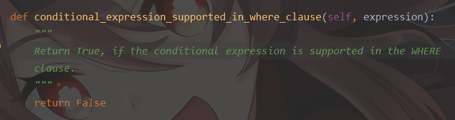

# website4

网站第四版，采用`django`+`rest_framework`+`vue`前后端分离式开发

`git`库中只包含`vue`编译后的文件，不包含`vue`源码

用于在服务器部署

## 说明

版本 `0.1.*` 属于开发版本，在开发版本内前端界面不会提交

## 在这里向后来接手这个项目的人道个歉

由于班级部分中间表的使用不熟练（当然中间表的信息可能本来就不是可以从多对多信息中查找到的）导致那一部分的各类信息处理都非常混乱，只能说是胡乱拼凑的，强行达到目的，如果你觉得不好，那就重新搭一次吧~~
当然已有的数据恐怕有亿点点难以处理，所以，，抱歉抱歉抱歉

实在是能力有限

## 注意

由于需要适配`djongo-mongodb`，修改了`django/db/backends/base/operations.py`
